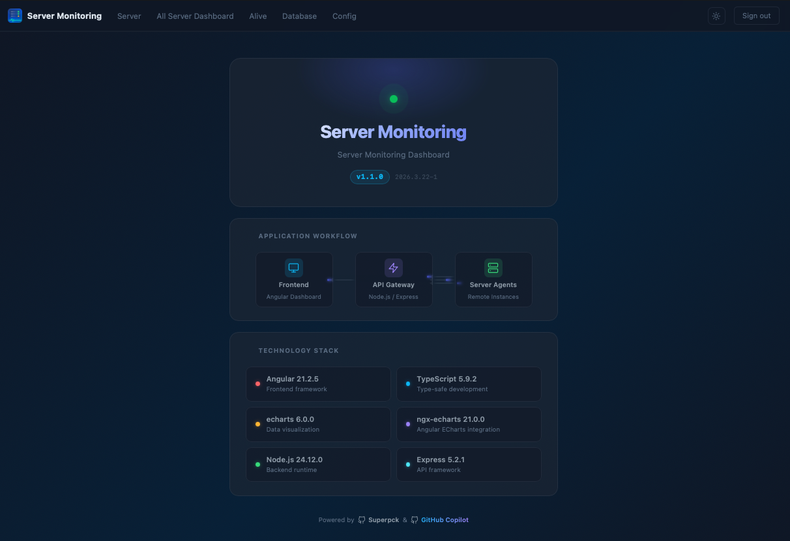

# Server Monitoring

A web-based dashboard for monitoring server metrics in real time.  
Consists of 3 parts: **Agent (`server-api`)**, **API Gateway (`api`)**, and **UI (`frontend`)**.

---

## Screenshots

**Login**  


**About**  


---

## Architecture

```
┌─────────────────────────────────────────────────────┐
│                      frontend                       │
│              Angular UI (port 4204)                 │
└────────────────────┬────────────────────────────────┘
                     │  Authorization: Bearer <JWT token>
          ┌──────────┴──────────┐
          │         api         │   ← API Gateway (port 4000)
          │  Express + SQLite   │
          └──────────┬──────────┘
                     │  X-Server-Key: <server_key>
     ┌───────────────┼───────────────┐
     ▼               ▼               ▼
 server-api       server-api      server-api
 (Server A)       (Server B)      (Server C)
  port 3003        port 3003       port 3003
```

### Security Chain

```
UI  ──[Bearer JWT]──►  api/  ──[X-Server-Key]──►  agent
                                                       │
                                        ✓ SERVER_KEY match?
                                        ✓ IP ∈ ALLOWED_IP_RANGES?
```

---

## Folders

### `server-api/` — Agent

Install on **every server you want to monitor**.  
An Express API that exposes the host machine's metrics (CPU, Memory, Disk, Network, Processes, Nginx, Database).

**Security:** Every request is verified by the `securityGuard` middleware.
- `SERVER_KEY` — requests must include a matching `X-Server-Key` header
- `ALLOWED_IP_RANGES` — (optional) restrict access to specific CIDRs (e.g. the API gateway IP)

**Port:** `3003` (configurable via `.env`)

**Required `.env`:**
```env
PORT=3003
SERVER_NAME=agent-server-01
SERVER_KEY=agent-secret-key-32to128chars
ALLOWED_IP_RANGES=192.168.100.1/32,10.0.0.0/8   # IP of the API gateway
```

**Endpoints:**
| Method | Path | Description |
|--------|------|-------------|
| GET | `/dashboard/summary` | Overview metrics (CPU, MEM, Disk, Network, Load, Processes) |
| GET | `/system` | System info |
| GET | `/monitor` | Real-time metrics |
| GET | `/database` | Database connection & query stats |
| GET | `/nginx/status` | Nginx service status |
| GET | `/nginx/logs` | Nginx error logs |
| GET | `/logs/service` | Service logs |

> All endpoints require the `X-Server-Key` header.

**Dev:**
```bash
cd server-api
npm install
npm run dev
```

**Production:**
```bash
npm run build   # compile TypeScript → dist/
npm start
# or use PM2: pm2 start ecosystem.config.js
```

---

### `api/` — Central API Gateway

An Express + SQLite backend acting as a proxy between the frontend and the agents.  
Manages server groups, agents, and user authentication.

**Port:** `4000`

**Required `.env`:**
```env
PORT=4000
JWT_SECRET=your-jwt-secret
API_KEY=your-ui-api-key
```

**Endpoints:**
| Method | Path | Auth | Description |
|--------|------|------|-------------|
| POST | `/auth/login` | — | Login, returns JWT |
| GET | `/servers` | — | List all groups with their agents (ordered by `seq`) |
| POST | `/servers/groups` | Admin | Create a group |
| PUT | `/servers/groups/:id` | Admin | Update a group (name, detail, seq) |
| DELETE | `/servers/groups/:id` | Admin | Delete a group (cascades agents) |
| POST | `/servers/agents` | Admin | Create an agent |
| PUT | `/servers/agents/:id` | Admin | Update an agent (name, url, seq, …) |
| DELETE | `/servers/agents/:id` | Admin | Delete an agent |
| PATCH | `/servers/agents/:id/toggle` | Admin | Toggle agent active/inactive |
| GET/POST | `/proxy/:agentId/*` | Auth | Proxy request to the target agent |

**Dev:**
```bash
cd api
npm install
npm run dev
```

**Production:**
```bash
npm run build
npm start
# or: pm2 start ecosystem.config.js
```

---

### `frontend/` — UI

Angular web application for viewing metrics from all registered agents.

**Port:** `4204`

**Pages:**
| Page | Description |
|------|-------------|
| **Login** | JWT-based authentication |
| **Alive** | Tree view of all agents — online/offline status, auto-refresh every 10 s |
| **Dashboard** | Server metrics charts (CPU, Memory, Disk, Network) |
| **Database** | Database monitoring per agent |
| **Nginx** | Nginx status and error log viewer |
| **PM2** | PM2 process list |
| **Secure** | Security log viewer |
| **Server Config** | Admin UI — manage groups & agents, drag-and-drop reordering (persisted via `seq`) |
| **Server Management** | Multi-server side-by-side monitoring |

**Dev:**
```bash
cd frontend
npm install
npm start          # ng serve --port 4204
```

**Build:**
```bash
npm run build      # output → dist/
```

---

## Quick Start

```bash
# 1 — Agent (run on each server to monitor)
cd server-api && npm run dev

# 2 — API Gateway (run on your central server)
cd api && npm run dev

# 3 — Frontend (run on your dev machine / web server)
cd frontend && npm start
```

Then open [http://localhost:4204](http://localhost:4204), log in, and add your server groups & agents via **Server Config**.

