# Server Monitoring — User Guide

A web-based dashboard for monitoring multiple servers in real time.  
This guide covers everything a day-to-day user needs: logging in, navigating the UI, reading metrics, and managing users.

---

## Table of Contents

1. [Getting Started](#1-getting-started)  
2. [Navigation Overview](#2-navigation-overview)  
3. [Server Management](#3-server-management)  
   - [Agent Overview](#31-agent-overview)  
   - [System Monitor](#32-system-monitor)  
   - [PM2 Monitor](#33-pm2-monitor)  
   - [Nginx Monitor](#34-nginx-monitor)  
   - [Database Monitor](#35-database-monitor)  
   - [Log Monitor](#36-log-monitor)  
4. [Alive Monitor](#4-alive-monitor)  
5. [Server Configuration](#5-server-configuration) *(Admin)*  
6. [User Management](#6-user-management) *(User Admin)*  
   - [Managing Users](#61-managing-users)  
   - [User Roles](#62-user-roles)  
   - [Agent Access Control](#63-agent-access-control)  
7. [About](#7-about)  
8. [Troubleshooting](#8-troubleshooting)  

---

## 1. Getting Started

### Logging In

Open the dashboard in your browser and you will be redirected to the **Login** page.

Enter your **username** and **password**, then click **Login**.

| Default account | Password | Role |
|---|---|---|
| `admin` | `Admin@1234` | Admin |
| `user1` | `User1@1234` | Monitor |

> **Important:** Change the default passwords immediately after first login. The `superadmin` account is configured separately in the server environment.

After a successful login the application redirects you to **Server Management**.

> 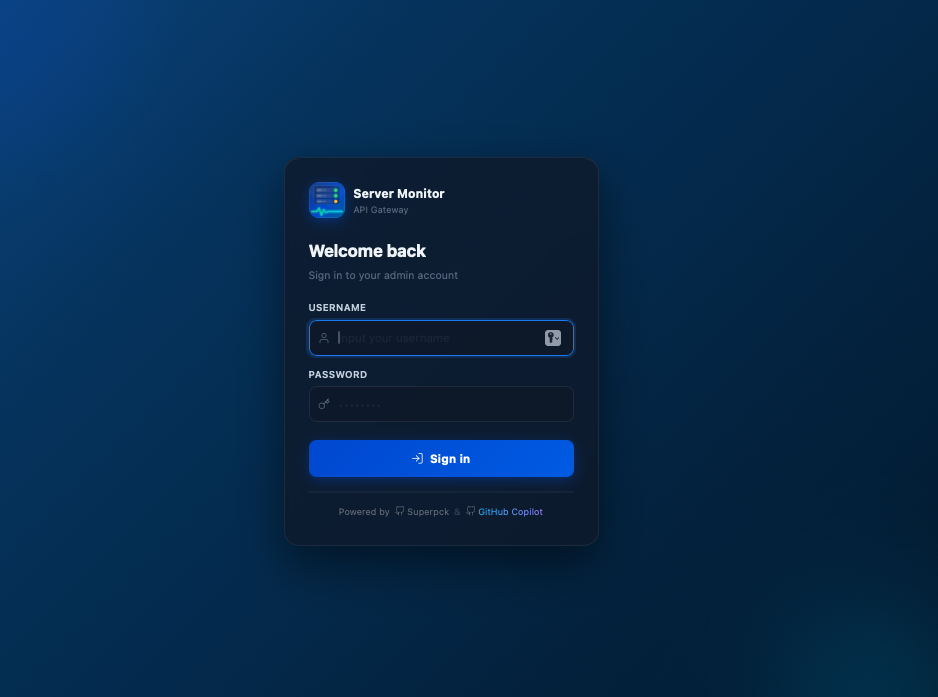

### Logging Out

Click the user icon in the top-right corner of the navigation bar and select **Logout**. Your session token is removed and you are returned to the Login page.

---

## 2. Navigation Overview

The sidebar (or top navigation bar) provides links to all sections of the application.

| Link | Description | Who can see |
|---|---|---|
| **Server Management** | Multi-server monitoring dashboard | Everyone |
| **Alive** | Agent online/offline status tree | Everyone |
| **Server Config** | Manage server groups and agents | Admin only |
| **User Management** | Create/edit users and access control | User Admin only |
| **About** | Application version and tech-stack info | Everyone |

> 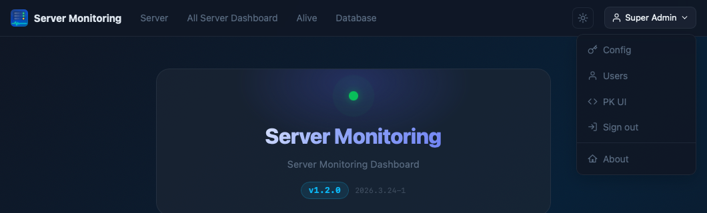

The application supports light and dark themes. Use the theme toggle (sun/moon icon) in the navigation bar to switch.

---

## 3. Server Management

The **Server Management** page lists all server groups in the left sidebar. Click a group or agent name to select it and view its monitoring data on the right panel.

Once a server agent is selected, six monitoring tabs are available across the top of the panel:

| Tab | Description |
|---|---|
| Agent Overview | High-level health summary |
| System Monitor | Real-time CPU, Memory, Disk, and Network charts |
| PM2 Monitor | PM2 process list and status |
| Nginx Monitor | Nginx service status and access/error logs |
| Database Monitor | Database connection checks and query metrics |
| Log Monitor | Security and system log viewer |

### 3.1 Agent Overview

Displays a compact summary of the selected server:

- **CPU** — current usage percentage and model
- **Memory** — used / total RAM
- **Disk** — used / total storage for each mounted partition
- **Load Average** — 1 / 5 / 15 minute averages
- **Uptime** — how long the server has been running
- **Network** — current inbound/outbound traffic rate

A colour-coded indicator (green / yellow / red) gives an at-a-glance health status for each metric.

### 3.2 System Monitor

Interactive charts (powered by Apache ECharts) that update periodically:

- **CPU Usage** — time-series line chart showing recent usage trend
- **Memory Usage** — used vs available comparison
- **Disk I/O** — read/write throughput
- **Network Traffic** — real-time inbound (rx) and outbound (tx) bytes per second

Use the time-range selector to zoom in on a specific window.

### 3.3 PM2 Monitor

Shows all processes managed by PM2 on the selected server:

| Column | Description |
|---|---|
| Name | PM2 application name |
| Status | online / stopped / errored |
| Restarts | Number of automatic restarts |
| CPU | Current CPU usage % |
| Memory | Current RSS memory |
| Uptime | Time since last (re)start |

### 3.4 Nginx Monitor

Requires `NGINX_LOG_ENABLED=true` on the agent for log data.

- **Status** — shows whether Nginx is running (detected via systemctl or Docker)
- **Access Log** — recent access log entries (configurable number of lines)
- **Error Log** — recent error log entries with real-time SSE streaming option

### 3.5 Database Monitor

Requires `DB_MONITOR_ENABLED=true` on the agent plus at least one `DB_<ID>_*` connection configured.

- **Status** — ping result (up/down) and latency for each configured database instance
- **Metrics** — connections, query rate, cache hit ratio, and other vendor-specific counters
- **Active Queries** — current or recent SQL queries

Supported databases: MySQL, MariaDB, Percona, PostgreSQL, MSSQL.

### 3.6 Log Monitor

Requires `SECURE_LOG_ENABLED=true` on the agent.

- **Log Sources** — lists all available log sources on the agent's platform (e.g. `auth`, `syslog`, `audit`)
- **Log Viewer** — displays the last N lines of the selected source

| Platform | Available sources |
|---|---|
| RHEL / CentOS / Rocky | auth, messages, audit |
| Debian / Ubuntu | auth, syslog, kern |
| macOS | auth, system, system-file |
| Windows | security, system |

> 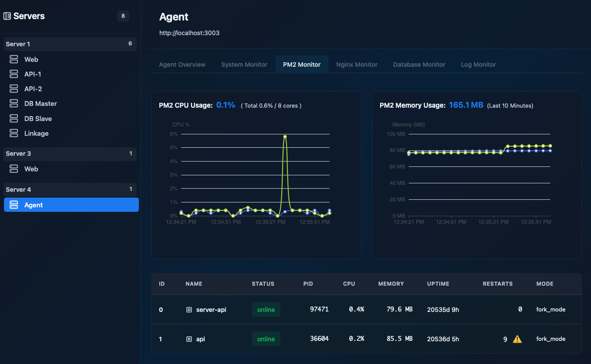

---

## 4. Alive Monitor

The **Alive** page gives you a bird's-eye view of every registered agent.

- Agents are displayed in a tree layout grouped by **Server Group**.
- Each agent shows its **online / offline** status (checked against the agent's `/system/health` endpoint), along with current CPU, Memory, and Disk percentages when online.
- The page **auto-refreshes every 10 seconds** so you can see changes without reloading.
- The status indicator uses colour coding: 🟢 green (healthy), 🟡 yellow (≥70%), 🔴 red / blinking (≥90%), grey (offline).
- An offline agent shows a blinking error badge with the reason.
- **Click any agent node** to open a detail panel showing CPU, Memory, Disk, Load Average, Network I/O, and Processes.
- Use the **↔ H / ↕ V** buttons in the top-right to switch between horizontal and vertical tree layouts. Your preference is saved automatically.

> 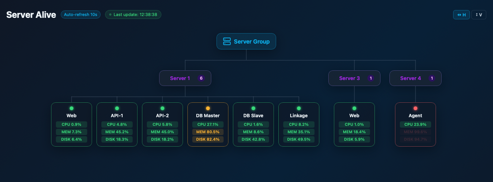
> 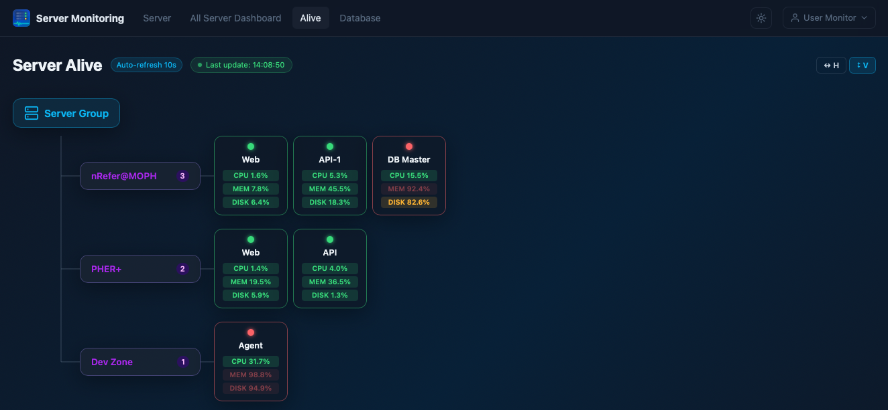

---

## 5. Server Configuration

*Requires Admin role.*

The **Server Config** page is where you register and organise the servers the dashboard monitors.

### Groups

Servers are organised into **Groups** (e.g. Production, Staging, Internal Tools).

- Click **+ Add Group** to create a new group (provide a name and optional description).
- Click the **pencil** icon next to a group name to edit it.
- Click the **× circle** icon to delete a group. Deleting a group removes all its agents as well.
- Drag the **⠿ handle** on a group card to reorder groups. The order is saved automatically.
- Click the collapse arrow to show/hide the agents inside a group.

> 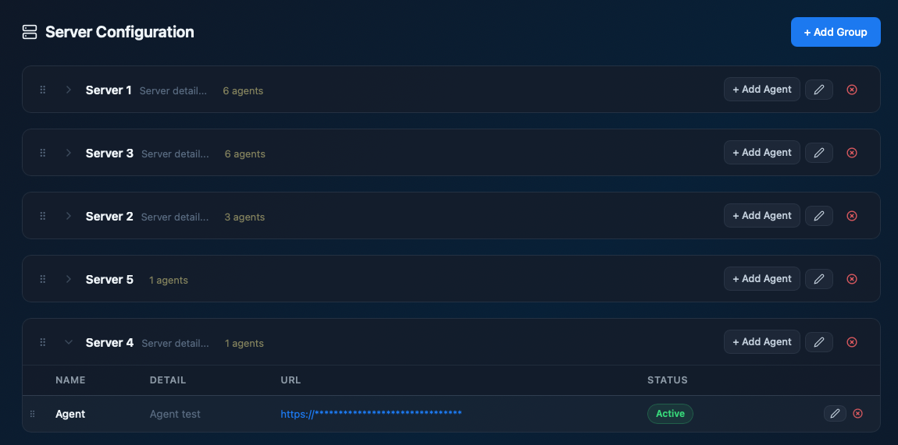

### Agents

Each group can contain one or more **Agents** (individual servers running `server-api`).

- Click **+ Add Agent** on a group card to register a new agent. Required fields:
  - **Name** — display name shown in the sidebar
  - **URL** — base URL of the agent's `server-api` (e.g. `https://myserver.example.com:3003`)
  - **Server Key** — the `SERVER_KEY` configured in the agent's `.env`
  - **Server Name** — the `SERVER_NAME` configured in the agent's `.env`
  - **Detail** — optional description
- Click the **pencil** icon on an agent row to edit its details.
- Click the **× circle** icon to delete an agent.
- Drag the **⠿ handle** on an agent row to reorder agents within the group.
- Use the **toggle switch** in the Status column to activate or deactivate an agent without deleting it. Inactive agents are hidden from the monitoring views.

> 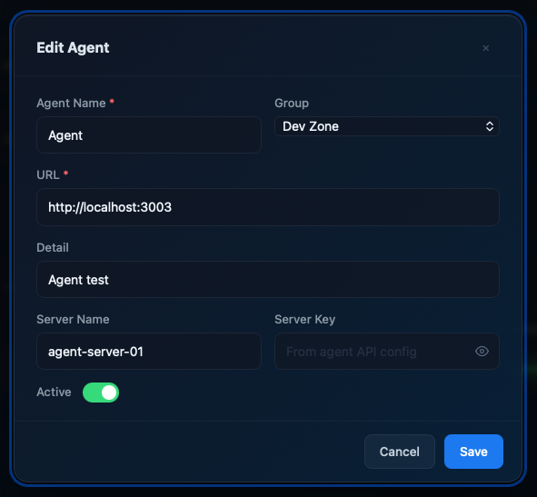

---

## 6. User Management

*Requires User Admin permission (`user_admin = 1`).*

### 6.1 Managing Users

The **User Management** page lists all registered accounts.

- **Add User** — click the **+ Add User** button and fill in:
  - Username (unique, cannot be `superadmin`)
  - Full name
  - Role — `admin` or `monitor`
  - User Admin — whether this account can manage other users
  - Password (minimum length enforced)
- **Edit User** — click the **pencil** icon on a user row to update name, role, user_admin flag, or password (leave password blank to keep the existing one).
- **Delete User** — click the **× circle** icon. You cannot delete the `superadmin` account or your own account.

> 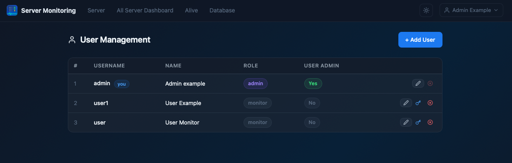

### 6.2 User Roles

| Role | Description |
|---|---|
| `admin` | Full access including Server Config, can toggle agents and see all groups |
| `monitor` | Read-only view of monitoring data; cannot modify server configuration |

The **User Admin** flag is independent of role — a `monitor` user can be granted User Admin rights to manage other accounts without gaining admin-level server access.

The **superadmin** account is defined in the server `.env` file (`SUPERADMIN_PASSWORD`). It is always an admin, does not appear in the database, and cannot be deleted from the UI.

> 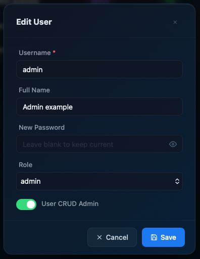

### 6.3 Agent Access Control

By default every non-admin user can see **all agents**. You can restrict a user to a specific subset.

1. Find the user in the User Management table.
2. Click the **🔑 key icon** in the Actions column (visible only for non-admin users).
3. In the **Agent Access** modal, choose the **Access Type**:
   - **All Agents** — the user sees every active agent (default).
   - **Partial Access** — a collapsible tree of server groups and agents appears.
4. When **Partial Access** is selected, use the tree to pick which agents this user may access:
   - **Check a group** — selects all agents inside that group at once.
   - **Uncheck a group** — deselects all agents in that group.
   - **Check / uncheck individual agents** — fine-grained control within a group.
   - A group checkbox shows a **dash (—)** when only some of its agents are selected.
5. Click **Save**.

> 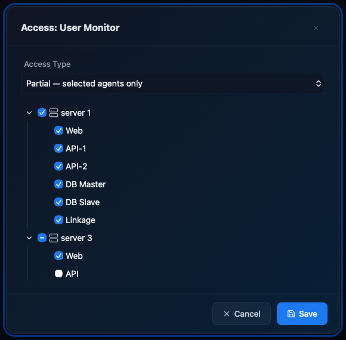

The restriction applies immediately. The user will only see the permitted agents in the Server Management sidebar and Alive monitor.

---

## 7. About

The **About** page displays:

- Application name and version
- Architecture workflow diagram (Frontend → API Gateway → Server Agents)
- Technology stack (Angular, TypeScript, Node.js, Express, ECharts, ngx-echarts)
- Links to relevant project sites

> 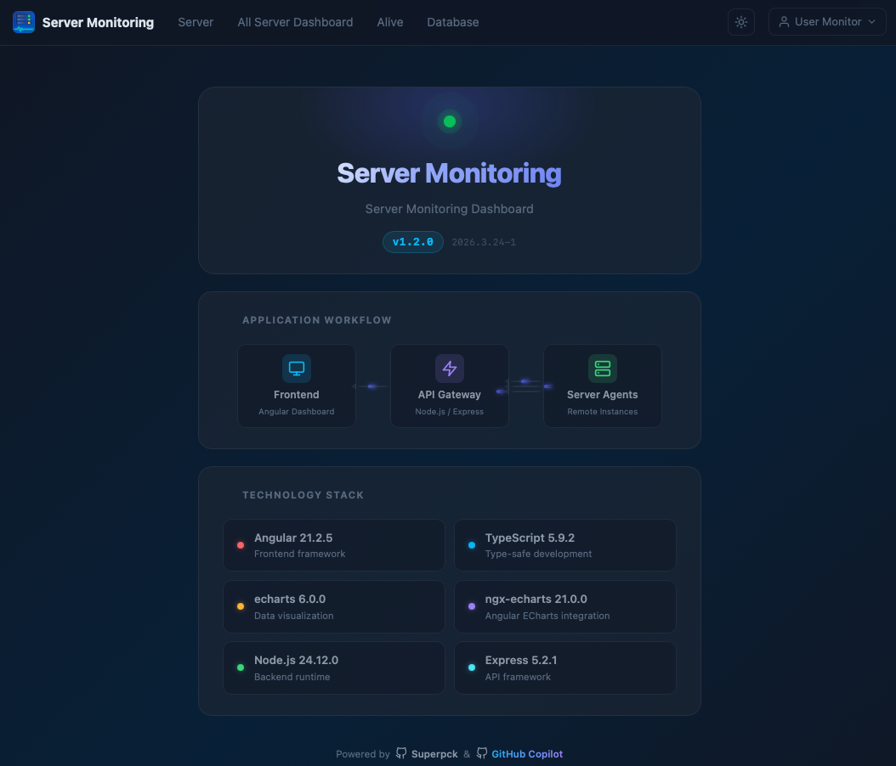

---

## 8. Troubleshooting

### Login fails with "Invalid credentials"

- Double-check username and password (both are case-sensitive).
- If you are using the `superadmin` account, ensure `SUPERADMIN_PASSWORD` is correctly set in the API's `.env`.
- The JWT session expires after the configured lifetime (default 8 hours). Log out and log in again.

### A server agent shows as offline

1. Verify the agent process is running on the target server (`pm2 list` or `systemctl status server-api`).
2. Check that the URL configured in Server Config is reachable from the API gateway server.
3. Verify the `SERVER_KEY` in Server Config exactly matches `SERVER_KEY` in the agent's `.env`.
4. Check firewall rules — the API gateway must be able to reach the agent port (default 3003).

### Monitoring tab shows "No data" or loading spinner

- Confirm the relevant feature flag is enabled in the agent's `.env` (e.g. `SYSTEM_OVERVIEW_ENABLED=true`, `NGINX_LOG_ENABLED=true`, `DB_MONITOR_ENABLED=true`, `SECURE_LOG_ENABLED=true`).
- Restart the agent after changing `.env` values: `pm2 restart server-api`.

### Database Monitor shows no metrics

- Ensure at least one `DB_<ID>_*` block is configured in the agent's `.env` with the correct credentials.
- Check the agent log (`pm2 logs server-api`) for connection errors.

### Cannot see certain agents after access control change

- Access control changes take effect immediately. The user may need to refresh the page.
- If a user is set to **Partial Access** with no agents selected, they will see no agents at all.

### Charts are not updating

- Charts poll the agent on a regular interval. A temporary network hiccup may pause updates.
- Reload the page. If the issue persists, check the browser console for errors and verify the API gateway is reachable.
